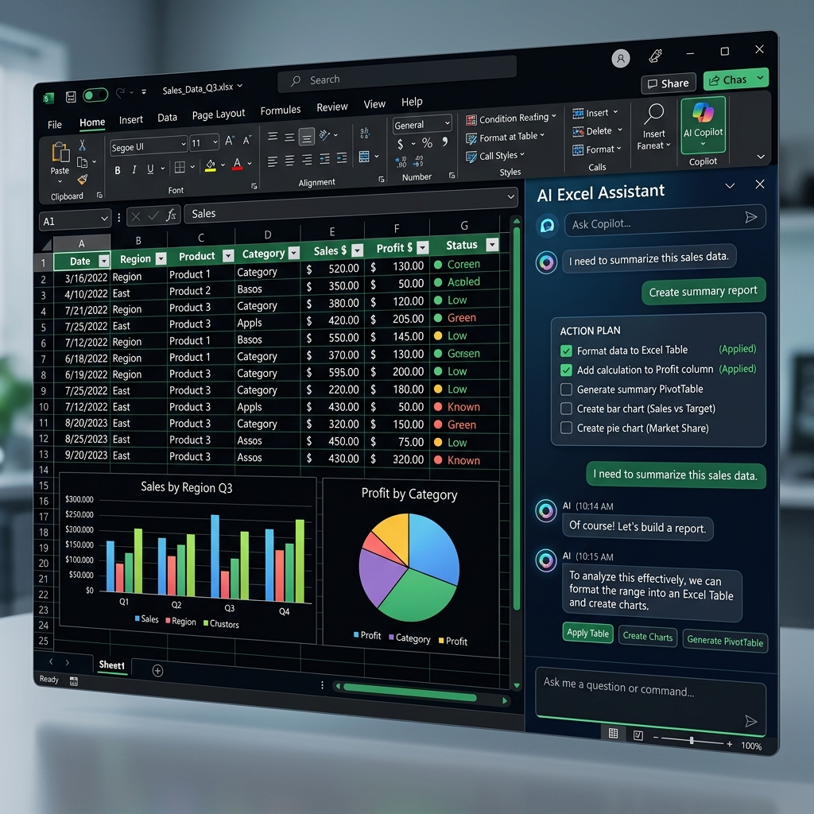

# 📊 AI Excel Assistant — Office Add-in Proyek Showcase

[](https://reactjs.org/)
[](https://www.typescriptlang.org/)
[](https://vitejs.dev/)
[](https://ai.google.dev/)
[](https://deepseek.com/)

**AI Excel Assistant** adalah sebuah aplikasi Microsoft Office Add-in modern berbasis React & TypeScript yang mengintegrasikan kecerdasan buatan (Google Gemini API & DeepSeek API) ke dalam lembar kerja Microsoft Excel Anda secara lokal. 

Proyek ini dibangun menggunakan **Office JS SDK** resmi dari Microsoft untuk memungkinkan interaksi dua arah secara real-time antara obrolan AI dengan tabel data Excel secara dinamis dan aman.

---

## 📷 Tangkapan Layar Proyek (Showcase)

Berikut adalah visualisasi bagaimana asisten AI ini berjalan berdampingan di panel samping (taskpane) Microsoft Excel untuk membantu pengguna mengotomatisasi pekerjaan pengolahan data:



---

## ⚡ Fitur Utama & Kemampuan Teknis

Aplikasi ini tidak hanya sekadar bot obrolan, melainkan sebuah **Action-Engine** terintegrasi yang mampu menerjemahkan bahasa alami pengguna menjadi aksi nyata pada Excel melalui SDK Microsoft Office.js:

1. **✍️ Generator Rumus Instan (Formula Generator)**
   * Mampu membuat rumus Excel kompleks (seperti `SUMIFS`, `VLOOKUP`, `INDEX/MATCH`, `IFERROR`) hanya dengan deskripsi teks biasa.
   * *Teknis:* Menulis langsung ke range sel menggunakan API `range.formulas`.

2. **🛠️ Pembuat Tabel Otomatis (Auto Excel Table)**
   * Secara cerdas mendeteksi jangkauan data mentah pada worksheet dan memformatnya menjadi Excel Table resmi lengkap dengan header otomatis.
   * *Teknis:* Mendaftarkan range data melalui `worksheet.tables.add()`.

3. **📊 Grafik & Diagram Cerdas (Interactive Chart Maker)**
   * Membuat visualisasi data instan berupa diagram batang, kolom, garis, atau lingkaran langsung di lembar kerja Anda sesuai instruksi pengguna.
   * *Teknis:* Menghasilkan chart menggunakan `worksheet.charts.add()`.

4. **🔄 Ringkasan Pivot Table (Pivot Table Builder)**
   * Menganalisis kumpulan data besar dan secara otomatis menyusun ringkasan Pivot Table dengan kolom dan baris yang sesuai.
   * *Teknis:* Menginisialisasi Pivot Table melalui `worksheet.pivotTables.add()`.

5. **🔍 Pengurutan & Penyaringan Dinamis (Sort & Filter)**
   * Melakukan sorting naik/turun (Ascending/Descending) pada kolom dan menerapkan filter kustom langsung dari instruksi obrolan AI.
   * *Teknis:* Memanggil `table.sort.apply()` dan `table.column.filter.apply()`.

6. **⚡ Sinkronisasi Lembar Kerja (Active Sheet Sync)**
   * Membaca informasi lembar kerja yang sedang aktif secara dinamis (nama sheet, jumlah kolom/baris, nama header) sebagai konteks bagi AI agar respons selalu presisi.

---

## 🛠️ Tech Stack & Arsitektur

* **Core Framework:** React 18 & TypeScript (untuk menjamin kualitas kode yang kuat, type-safe, dan modular).
* **Builder Tool:** Vite (untuk build aplikasi super cepat dan performa tinggi).
* **Styling:** Custom Vanilla CSS (dirancang dari awal dengan variabel dinamis, gaya *glassmorphism* modern, efek transisi halus, dan tema gelap premium yang nyaman di mata).
* **Office Integration:** Microsoft Office JS API SDK (berjalan secara *native* di Excel desktop & web).
* **AI Orchestration:** Dukungan multi-provider (Google Gemini API SDK & DeepSeek API) menggunakan *structured JSON output schema* untuk meminimalkan halusinasi model dan mengeksekusi rencana aksi yang berurutan (*transactional sequential actions*).

### 🔒 Keamanan Data & Privasi (Security First)
* **Zero Database & Backend:** Tidak menggunakan server perantara atau database pihak ketiga.
* **Keamanan Kunci API:** API Key pengguna disimpan secara aman dan terenkripsi secara lokal di `localStorage` browser pengguna. API Key dikirim langsung ke endpoint resmi Google/DeepSeek secara client-side demi menjamin privasi data perusahaan Anda.

---

## 🚀 Langkah Instalasi & Sideloading (Untuk HR / Recruiter Review)

Untuk menjalankan proyek ini secara lokal dan memasangnya di Microsoft Excel Anda, ikuti langkah-langkah berikut:

### 1. Kloning & Jalankan Server Lokal
Pastikan Anda sudah menginstal [Node.js](https://nodejs.org/).
```bash
# 1. Kloning repositori ini
git clone https://github.com/username/ai-tools-excel.git
cd ai-tools-excel

# 2. Instal dependensi proyek
npm install

# 3. Jalankan server pengembangan lokal (Vite)
npm run dev
```
Aplikasi web lokal akan berjalan di `http://localhost:5173`.

### 2. Melakukan Sideloading ke Microsoft Excel
Untuk melihat asisten AI ini terintegrasi di dalam lembar kerja Microsoft Excel Anda:
1. Pastikan Anda memiliki berkas `manifest.xml` di dalam direktori root proyek ini. Berkas ini bertindak sebagai penunjuk jalan bagi Microsoft Excel ke server lokal kita (`https://localhost:3000` atau `http://localhost:5173` sesuai konfigurasi manifest).
2. Ikuti instruksi sideload resmi dari Microsoft berdasarkan platform Anda:
   * **Excel Web (Office 365):** Buka Excel di web -> Buat workbook baru -> Tab **Insert** -> Klik **Office Add-ins** -> **Upload My Add-in** -> Pilih berkas `manifest.xml` di komputer Anda.
   * **Excel Desktop (Windows):** Buat folder bersama di komputer Anda -> Letakkan `manifest.xml` di dalamnya -> Di Excel, buka **File** -> **Options** -> **Trust Center** -> **Trust Center Settings** -> **Trusted Add-in Catalogs** -> Tambahkan jalur folder tersebut -> restart Excel dan cari di tab **Developer** -> **Add-ins**.

---

## 🌟 Demo Browser (Mode Demo Interaktif)
Jika Anda tidak memiliki akses ke Microsoft Excel Desktop atau hanya ingin meninjau antarmuka UI/UX, Anda dapat mengunjungi tautan demo Vercel proyek ini:

🔗 **[Tautan Live Demo Vercel](https://ai-tools-excel-qioe.vercel.app/)**

*Catatan: Saat dijalankan langsung di browser, aplikasi akan berjalan dalam **Demo Mode** (menampilkan visualisasi portofolio & fitur di sebelah kanan, serta tetap mengizinkan Anda mengobrol dengan asisten untuk melihat Rencana Aksi yang diusulkan).*

---
Dibuat dengan penuh 💻 dan dedikasi oleh pengembang yang bersemangat dalam membangun solusi otomatisasi bertenaga AI.
